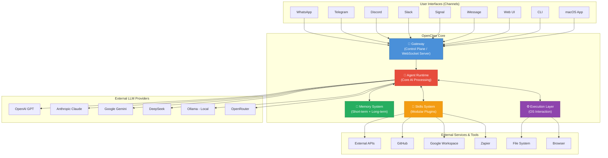
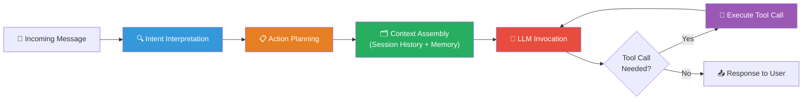
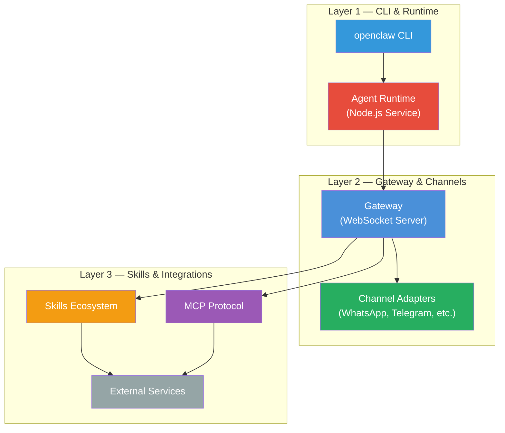
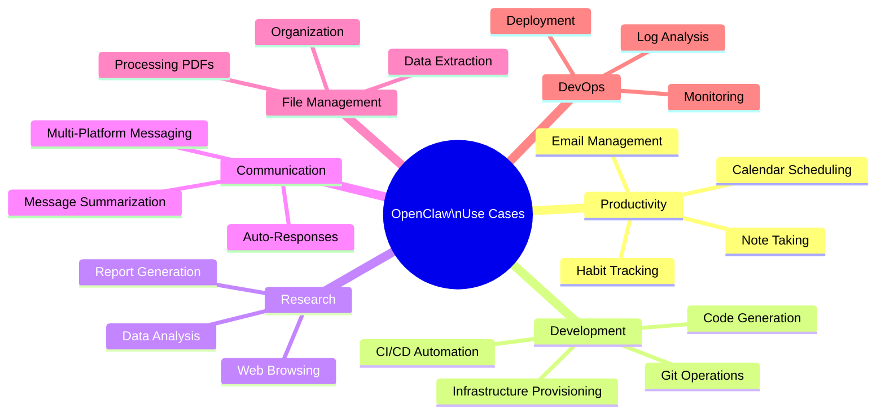

# OpenClaw AI — Detailed Explanation & Architecture

## 1. What is OpenClaw?

**OpenClaw** is a **free, open-source, self-hosted autonomous AI agent** that functions as a personal AI assistant running entirely on your own devices. It is often described as an **"Operating System for AI Agents"** — going far beyond a simple chatbot by actually *executing tasks* on your behalf.

> [!IMPORTANT]
> OpenClaw does **not** include its own LLM. It connects to external LLM providers (OpenAI, Anthropic Claude, Google Gemini, DeepSeek, Ollama, etc.) and wraps them with an autonomous execution layer, tools, memory, and multi-channel messaging.

### Origin & History

| Date | Event |
|---|---|
| **November 2025** | Launched as **"Clawdbot"** by **Peter Steinberger** |
| **December 2025** | Rebranded to **"Moltbot"** |
| **January 2026** | Rebranded to **"OpenClaw"** |
| **February 2026** | Peter Steinberger moved to OpenAI; OpenClaw transitioned to an **open-source foundation** |

- **License:** Open Source (MIT)
- **GitHub:** [github.com/openclaw/openclaw](https://github.com/openclaw/openclaw)
- **Website:** [openclaw.ai](https://openclaw.ai)
- **Docs:** [docs.openclaw.ai](https://docs.openclaw.ai)

---

## 2. High-Level Architecture

OpenClaw uses a **hub-and-spoke architecture** centered around a component called the **Gateway**. The architecture cleanly separates the **interface layer** (messaging channels) from the **agent runtime** (AI processing), ensuring conversation state and tool access are centrally managed on the user's hardware.



---

## 3. Core Components — Deep Dive

### 3.1 🔀 Gateway (Control Plane)

The **Gateway** is the heart of OpenClaw's hub-and-spoke architecture. It acts as a **WebSocket server** and **message router**.

| Responsibility | Description |
|---|---|
| **Message Routing** | Receives messages from all connected channels and dispatches them to the Agent Runtime |
| **Session Management** | Manages user sessions, conversation contexts, and authentication |
| **Multi-Agent Routing** | Routes inbound messages from different channels/accounts to **isolated agents**, each with its own workspace |
| **Multi-Channel Inbox** | Enables the assistant to respond across WhatsApp, Telegram, Slack, Discord, Signal, iMessage, Web UI, CLI, etc. |
| **Authentication** | Handles user identity and access control |

> [!TIP]
> The Gateway ensures that you can send a message from **any** platform and get a consistent AI-powered response. The agent doesn't care where the message originates.

---

### 3.2 🧠 Agent Runtime (Core AI Processing)

The **Agent Runtime** is where all the AI "thinking" happens. It operates as a **long-running Node.js service** (Node.js 22+ recommended).



**Key responsibilities:**

1. **Intent Interpretation** — Understands what the user wants
2. **Action Planning** — Breaks complex requests into executable steps
3. **Context Assembly** — Gathers session history, long-term memory, and relevant skill data
4. **LLM Invocation** — Sends the assembled context to the configured LLM provider
5. **Tool Execution** — Executes tool calls returned by the LLM (file ops, shell commands, API calls, etc.)
6. **Agentic Loop** — Iterates through plan → execute → observe cycles until the task is complete

---

### 3.3 💾 Memory System

OpenClaw's memory is **dual-layered**, stored locally in Markdown/YAML files:

| Memory Type | Purpose | Storage | Example |
|---|---|---|---|
| **Short-term Memory** | Current conversation context and session state | In-memory / session files | "User asked about weather in Mumbai" |
| **Long-term Memory** | Persistent user preferences, history, and learned behavior | Local Markdown/YAML files | "User prefers dark mode, uses VS Code, works at Cybage" |

> [!NOTE]
> All memory is stored **locally on your machine**, not in any cloud. This is a critical privacy feature — OpenClaw never sends your personal data to third parties beyond the LLM API calls themselves.

---

### 3.4 🔧 Skills System (Modular Plugin Architecture)

Skills are OpenClaw's **extension mechanism** — think of them as **"apps for AI agents."** They are community-built, modular plugins defined in `SKILL.md` files.

```mermaid
graph LR
    subgraph "Skill Categories"
        A["🔗 Tool Invocation\nAPIs, DBs, Services"]
        B["🧠 Memory Mgmt\nContext, Preferences"]
        C["📋 Task Decomposition\nComplex → Sub-tasks"]
        D["📊 Data Interpretation\nRaw Data → Decisions"]
        E["🤝 Multi-Agent\nCoordination"]
        F["🛠️ DevOps & Coding\nCI/CD, Infra, Monitoring"]
        G["🔬 Research\nWeb Search, Analysis"]
        H["💬 Communication\nEmail, Messaging"]
        I["🎨 Creative\nContent, Design"]
    end

    style A fill:#3498DB,color:#fff
    style B fill:#27AE60,color:#fff
    style C fill:#E67E22,color:#fff
    style D fill:#9B59B6,color:#fff
    style E fill:#E74C3C,color:#fff
    style F fill:#1ABC9C,color:#fff
    style G fill:#F39C12,color:#fff
    style H fill:#2ECC71,color:#fff
    style I fill:#E91E63,color:#fff
```



**Example skills include:**
- **Brave Search** — Web searching
- **PDF Tool** — Reading and processing PDFs
- **Exec Tool** — Running shell commands
- **Firecrawl** — Web scraping and crawling
- **Google Workspace** — Gmail, Google Drive, Calendar integration
- **GitHub** — Repository management, issue tracking
- **Zapier** — Connecting to 5000+ apps

---

### 3.5 ⚙️ Execution Layer

The execution layer is what makes OpenClaw an **agent** rather than just a chatbot. It allows the AI to:

| Capability | Description |
|---|---|
| **Shell Commands** | Run terminal/CLI commands on the host system |
| **File Management** | Read, write, create, and organize files |
| **Browser Automation** | Navigate the web, fill forms, scrape data |
| **Application Interaction** | Interact with installed applications |
| **API Calls** | Make HTTP requests to external services |

> [!WARNING]
> The Execution Layer gives OpenClaw **high-level system privileges**. This is why running it in a **Docker container** (sandboxed) is strongly recommended for security.

---

### 3.6 📡 Channel Adapters

Channel Adapters are the connectors that link OpenClaw to messaging platforms:

| Platform | Type | Protocol |
|---|---|---|
| **WhatsApp** | Consumer messaging | WhatsApp Business API / Bridge |
| **Telegram** | Consumer messaging | Telegram Bot API |
| **Discord** | Community/Team | Discord Bot API |
| **Slack** | Enterprise/Team | Slack App API |
| **Signal** | Privacy-focused | Signal Bridge |
| **iMessage** | Apple ecosystem | macOS Bridge |
| **Web UI** | Browser-based | HTTP/WebSocket |
| **CLI** | Terminal-based | Stdin/Stdout |
| **macOS App** | Native app | Native APIs |

---

## 4. MCP (Model Context Protocol) Integration

OpenClaw acts as both an **MCP client** and an **MCP server**:

- **As MCP Server:** Exposes its registry of instructions (prompts, skills, workflows) to other MCP-compatible AI tools like **Claude Desktop**, **Continue**, and others.
- **As MCP Client:** Can consume tools and resources from external MCP servers.

This makes OpenClaw a first-class citizen in the broader AI tooling ecosystem.

---

## 5. LLM Provider Support

OpenClaw is **model-agnostic** and supports a wide range of LLM providers:

| Provider | Models | Notes |
|---|---|---|
| **OpenAI** | GPT-4o, GPT-4, Codex | Most popular choice |
| **Anthropic** | Claude 3.5 Sonnet, Claude 3 Opus | Strong coding & reasoning |
| **Google** | Gemini Pro, Gemini Flash | Free tier available |
| **DeepSeek** | DeepSeek V3, R1 | Cost-effective |
| **Mistral AI** | Mixtral, Mistral Large | Open-source friendly |
| **Ollama** | Llama 3, Phi-3, etc. | Fully local, no API key needed |
| **OpenRouter** | 41+ models | Single API key for many providers |
| **Amazon Bedrock** | Various foundation models | AWS integration |
| **Custom** | Any OpenAI-compatible API | Maximum flexibility |

> [!TIP]
> **ClawRouter** is a companion project — an agent-native LLM router that routes requests to 41+ models based on a **15-dimension scoring system** with less than **1ms routing latency**.

---

## 6. Installation & Deployment

### 6.1 Prerequisites
- **Node.js 22+**
- **Git**
- **Homebrew** (for macOS/Linux)

### 6.2 Installation Methods

````carousel
### Method 1: Script Install (macOS/Linux)
```bash
# Install OpenClaw
curl -fsSL https://openclaw.ai/install.sh | bash

# Run onboarding wizard
openclaw onboard --install-daemon
```
<!-- slide -->
### Method 2: Script Install (Windows)
```powershell
# Install OpenClaw via PowerShell
iwr https://openclaw.ai/install.ps1 -useb | iex

# Run onboarding wizard
openclaw onboard --install-daemon
```
<!-- slide -->
### Method 3: Docker (Recommended for Security)
```bash
# Clone the repository
git clone https://github.com/openclaw/openclaw.git
cd openclaw

# Run with Docker Compose
docker compose up -d
```
Docker provides:
- ✅ Sandboxed isolation
- ✅ Non-root user by default
- ✅ No host dependency pollution
- ✅ Easy cleanup with `docker compose down`
<!-- slide -->
### Method 4: VPS / Cloud Hosting
Many VPS providers (Hostinger, DigitalOcean, Contabo) offer **one-click OpenClaw deployments** using pre-configured Docker templates.
````

### 6.3 Onboarding Wizard

After installation, `openclaw onboard --install-daemon` walks you through:
1. **Selecting configuration mode** (basic / advanced)
2. **Choosing your LLM provider** (OpenAI, Claude, Gemini, etc.)
3. **Entering API keys**
4. **Registering OpenClaw as a background service** (daemon)
5. **Accessing the Control UI** at `http://127.0.0.1:18789/`

---

## 7. Three-Layer Deployment Architecture



| Layer | Components | Responsibility |
|---|---|---|
| **Layer 1** | CLI + Agent Runtime | Launching, managing, and processing AI tasks |
| **Layer 2** | Gateway + Channel Adapters | Message routing, session management, multi-channel inbox |
| **Layer 3** | Skills + MCP + External Services | Extending capabilities, connecting to the world |

---

## 8. Key Features Summary

| Feature | Description |
|---|---|
| 🏠 **Self-Hosted** | Runs entirely on your infrastructure — full data control |
| 🤖 **Autonomous Agent** | Executes multi-step tasks without constant supervision |
| 📱 **Multi-Channel** | WhatsApp, Telegram, Discord, Slack, Signal, iMessage, Web, CLI |
| 🧠 **Memory** | Short-term (session) + Long-term (persistent) memory |
| 🔧 **Skills Ecosystem** | Extensible plugin system with community-built skills |
| 🔄 **Model Agnostic** | Works with OpenAI, Claude, Gemini, DeepSeek, Ollama, and 41+ others |
| 🔌 **MCP Compatible** | Acts as both MCP client and server |
| 🐳 **Docker Support** | Official Docker images for secure, sandboxed deployment |
| 🔐 **Privacy First** | All data stored locally; no cloud dependency |
| 🤝 **Multi-Agent** | Supports routing to isolated agents with separate workspaces |
| 🎙️ **Voice Messages** | Can process and respond to voice messages |
| 🌐 **Open Source** | MIT licensed, community-driven development |

---

## 9. Use Cases



---

## 10. OpenClaw vs. Traditional Chatbots

| Aspect | Traditional Chatbot | OpenClaw |
|---|---|---|
| **Execution** | Can only *suggest* actions | Can *execute* actions on your system |
| **Hosting** | Cloud-hosted (vendor-controlled) | Self-hosted (you control everything) |
| **Memory** | Session-based only | Persistent long-term + short-term memory |
| **Channels** | Usually just one | 9+ messaging platforms simultaneously |
| **Extensions** | Limited or none | Rich skills ecosystem |
| **Privacy** | Data sent to vendor | Data stays on your machine |
| **Cost** | Subscription fees | Only pay for LLM API usage |
| **Customization** | Limited | Fully customizable via skills, prompts, workflows |

---

> [!NOTE]
> OpenClaw represents a paradigm shift from **"AI as a service"** to **"AI as infrastructure"** — treating AI agents as something you own, operate, and control, just like you would a web server or database.
